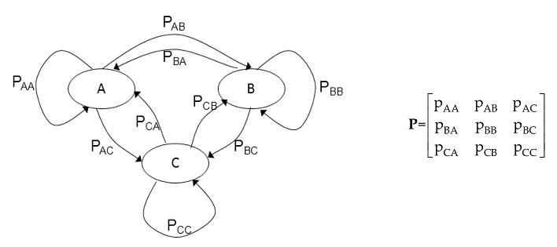
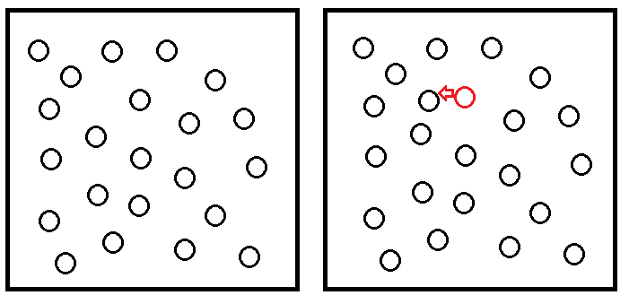

## A Simulation of Bilateral Migration Using Markov Chain Monte Carlo

- Inspired originally by modeling population as a markov chain



## Two Region Markov Chain Example

- Outlined in the paper "Using Markov Chains to Model Human Migration in a Network Equilibrium Framework", by J. Pan and A. Nagurney

- For the individual, each region is assumed to have its own utility function, which is a function of its population, and a cost of moving, which is a function of the number of people moving in the current iteration. 

- The two regions have an initial population vector $p = [p_1, p_2]$

- The flow matrix, which we solve for, will be $F = \left[ \begin{array}{cc} f_{11} & f_{12} \\ f_{21} & f_{22} \end{array} \right]$

## Two Region Markov Chain Example

- This leaves us with the functions $u_1 (p)$, $u_2 (p)$, $c_{12} (f)$ and $c_{21} (f)$. 

- People will move from locations of lower utility to locations of higher utility.

- At each iteration, we can solve the following for f:

$$ u_i (p) + c_{ij} (f) = u_j (p) $$

## Two Region Markov Chain Example


## Two Region Markov Chain Example


## Two Region Markov Chain Example

```{r include=FALSE}

library(ggplot2)

library(reshape2)

library(knitr)

library(ggthemes)

u1pan <- function(p){
  return(-p[1]+8)
}

u2pan <- function(p){
  return(-p[2]+14)
}

c12pan <- function(f){
  return(2*f[1])
}

c21pan <- function(f){
  return(2*f[2])
}


```

```{r}

flowcalcpan <- function(p){
  if(u2pan(p) > u1pan(p)){
    f1 <- (p[1] - p[2] + 6)/4
    f <- c(f1,0)
  }else if(u1pan(p) > u2pan(p)){
    f2 <- (p[2] - p[1] - 6)/4
    f <- c(0,f2)
  }else{f <- c(0,0)}
  
  return(f)
}

```

## Two Region Markov Chain Example

```{r}

p0 <- c(4,2)

pdatapan <- data.frame(p1 = 4, p2 = 2, u1 = u1pan(p0), 
                       u2 = u2pan(p0))

iter <- 1:5

for(i in iter){
  p <- c(tail(pdatapan$p1,1),tail(pdatapan$p2,1))
  f <- flowcalcpan(p)
  u <- c(u1pan(p),u2pan(p))
  totu <- sum(p*u)

  pdatapan <- rbind(pdatapan, c(p[1]-f[1]+f[2], 
                                p[2]+f[1]-f[2], u))
}

```

## Two Region Markov Chain Example

```{r echo=FALSE}
pdatapan$iter <- 1:length(pdatapan$p1)

pdatapan <- pdatapan[,c(5,1,2,3,4)]

kable(pdatapan, format = "markdown")

```

## Adding Monte Carlo

- Inspired by the original use of the Metropolis-Hastings Algorithm:



## Adding Monte Carlo

- Every possible state of molecules can be sampled by an iterative process. Move a molecule, then calculate the energy state of the system. If the energy state improves, accept the move. If not, accept it with some probability based on the change of the energy level.

## Adding Monte Carlo

- The algorithm for bilateral migration is very similar. We pick two locations at random, and calculate the relative utility between the two locations. We accept the move if $u_i (p) + c_{ij} (f) < u_j (p)$

- If the inequality doesn't hold, we accept the move with a certain probability. For this algorithm, I defined this probability as:

$$ Prob_{accept} = \frac{u_j (p) - c_{ij} (1)}{u_i (p)} $$

- Note: The markov chain no longer refers to the locations, but to different population distributions.

## Population Over Time

```{r echo=FALSE}

u1 <- function(p){
  return(-p[1]+8000)
}

u2 <- function(p){
  return(-p[2]+14000)
}

c12 <- function(f){
  return(2*f[1])
}

c21 <- function(f){
  return(2*f[2])
}

p0 <- c(4000,2000)

flowcalc <- function(p){
  if(u2(p) > u1(p)){
    f1 <- (p[1] - p[2] + 6000)/4
    f <- c(f1,0)
  }else if(u1(p) > u2(p)){
    f2 <- (p[2] - p[1] - 6000)/4
    f <- c(0,f2)
  }else{f <- c(0,0)}
  
  return(f)
}

p0 <- c(4000,2000)
pdata <- data.frame(p1 = 4000, p2 = 2000, u1 = u1(p0), u2 = u2(p0))

pdatastep <- function(pdata){

  location <- sample(c(1,2),1)

  p <- c(tail(pdata$p1,1),tail(pdata$p2,1))

  if(location == 1){
    if(p[1] >= 10 && p[2] <= 5990){
      if(u1(p) < u2(p) - 200){
        p[1] <- p[1]-10
        p[2] <- p[2]+10
        pdata <- rbind(pdata,c(p,u1(p),u2(p)))
      }else{
        probmove <- (u2(p) - 200)/u1(p)
        if(runif(1) < probmove){
          p[1] <- p[1]-10
          p[2] <- p[2]+10
          pdata <- rbind(pdata,c(p,u1(p),u2(p)))
        }else{
          pdata <- rbind(pdata,c(p,u1(p),u2(p)))
        }
      }
    }else{
      pdata <- rbind(pdata,c(p,u1(p),u2(p)))
    }
    #print("location1")
  }
  
  if(location == 2){
    if(p[2] >= 10 && p[1] <= 5990){
      if(u2(p) < u1(p) - 200){
        p[2] <- p[2]-10
        p[1] <- p[1]+10
        pdata <- rbind(pdata,c(p,u1(p),u2(p)))
      }else{
        probmove <- (u1(p) - 200)/u2(p)
        if(runif(1) < probmove){
          p[2] <- p[2]-10
          p[1] <- p[1]+10
          pdata <- rbind(pdata,c(p,u1(p),u2(p)))
        }else{
          pdata <- rbind(pdata,c(p,u1(p),u2(p)))
        }
      }
    }else{
      pdata <- rbind(pdata,c(p,u1(p),u2(p)))
    }
    #print("location2")
  }
  
  #print("moo")
  
  return(pdata)

}


for(i in 1:9999){
  pdata <- pdatastep(pdata)
}

pdata$iter <- 1:length(pdata$p1)

pdatamelt <- melt(pdata, id.vars=c("u1","u2","iter"), measure.vars=c("p1","p2"),
                  variable.name="region", value.name="population")

ggplot(pdatamelt, aes(x=iter, y=population,color=region)) + geom_line() +
  theme_tufte()

```

## Population Histograms

```{r echo=FALSE}

ggplot(pdatamelt, aes(x=population, fill=region)) + 
  geom_histogram(binwidth = 10) + theme_tufte()

```

## Next Steps

- Apply this to models with more than two regions! 

- Try to perform some sensitivity analysis on the different constraints, such as how we define utility and cost functions, and initial populations.

- Examine the discrepancy between an individual's utility and social utility in this model

## Next Steps

```{r echo=FALSE}

pdatapan$totalU <- pdatapan$p1*pdatapan$u1 +
  pdatapan$p2*pdatapan$u2

kable(pdatapan)

```

## Extensions Beyond The Scope of This Project

- Originally we wanted to relate this to actual economic data: Representing utility by employment opportunities and costs by housing prices.


