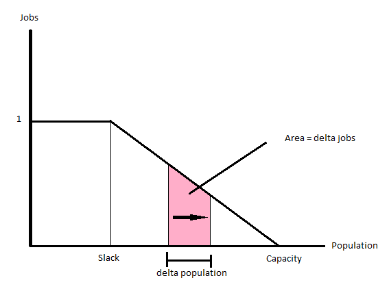

So for the effect of migration of employment, I'm starting with a simple employment model. I defined two critical values: a "slack" and a "capacity" population number.

Capacity is meant to be the capacity of the economy,  and I defined it as the point at which 1 additional person will result in 0 additional jobs. Slack is meant to be a very underutilized economy, where 1 additional person adds 1 additional job (we could even imagine situations where 1 more person adds more than 1 job, but to keep things simple I created a 1-1 zone here.) 

Here's a graph showing this model, x axis is the population, while y is the number of jobs added by 1 marginal person at that population. If the population is greater than capacity, this number is 0. If it's less than slack, it's 1. And, if it's between slack and capacity, I just made it a linear function.



Since we're looking at marginal jobs, the area under the curve is the number of jobs we're adding in total. 

Now, lets look at a situation where we're at capacity in two regions. I defined a "frictional" unemployment rate of 2% at this capacity:

```{r}
totalPop <- 10000

capacity <- c(5000,5000)

slack <- c(4000,4000)

capjobs <- 0.98*capacity

UE <- 1-(capjobs/capacity)

avgUE <- sum((capacity/totalPop)*UE)

avgUE

```

I took an average UE by weighting the unemployment rate by population. Now, I'll define some functions to help me out:

marginalJobs: given a population, slack, and capacity, calculates the marginal number of jobs added from an increase in population.

numjobsraw: calculates the area under the curve from p1 to p2 (negative if p1 > p2)

numjobs: uses numjobsraw, and has a series of if-else statements to calculate the area under the curve even if populations are below slack or above capacity.

```{r}
marginaljobs <- function(p, capacity, slack){
  return((capacity - p)/(capacity - slack))
}

intmarginaljobs <- function(p, capacity, slack){
  imj <- (2*capacity*p - p^2)/(2*capacity - 2*slack)
  return(imj)
}

numjobsraw <- function(p1,p2,capacity,slack){
  nj <- intmarginaljobs(p2,capacity,slack) - 
    intmarginaljobs(p1,capacity,slack)
  return(nj)
}

numjobs <- function(p1,p2,capacity,slack){
  if(p1 < slack){
    if(p2 < slack){
      #print(1)
      return((p2-p1))
    }else if(p2 >= slack && p2 < capacity){
      nj <- (slack-p1) + numjobsraw(slack,p2,capacity,slack)
      #print(2)
      return(nj)
    }else{
      nj <- (slack-p1) + numjobsraw(slack,capacity,capacity,slack)
      #print(3)
      return(nj)
    }
    
  }else if(p1 >= slack && p1 < capacity){
    if(p2 < slack){
      nj <- (p2-slack) + numjobsraw(p1,slack,capacity,slack)
      #print(4)
      return(nj)
    }else if(p2 >= slack && p2 < capacity){
      nj <- numjobsraw(p1,p2,capacity,slack)
      #print(5)
      return(nj)
    }else{
      nj <- numjobsraw(p1,capacity,capacity,slack)
      #print(6)
      return(nj)
    }
    
  }else{
    if(p2 < slack){
      nj <- numjobsraw(capacity,slack,capacity,slack) + (p2 - slack)
      #print(7)
      return(nj)
    }else if(p2 >= slack && p2 < capacity){
      nj <- numjobsraw(capacity,p2,capacity,slack)
      #print(8)
      return(nj)
    }else{
      #print(9)
      return(0)
    }
  }
}

```

Now lets see what happens to the average unemployment rate if we move 500 people from one region to another:

```{r}
deltaPop <- c(-500,500)
deltaJobs <- c(numjobs(5000,4500,5000,4000),numjobs(5000,5500,5000,4000))

population <- capacity + deltaPop
jobs <- capjobs + deltaJobs
UE <- 1-(jobs/population)
avgUE <- sum((capacity/totalPop)*UE)

avgUE

```

So, this shows what happens when people move from a productive configuration to a non-productive configuration. Overall unemployment increases. Given this new configuration, 500 people would be better off if they moved back to region A.

*****************************************

Now to try to apply MCMC to the pan model. First, just a repeat of how this would run (with larger populations).

First, how it runs towards equilibrium as a markov chain:

```{r}

u1 <- function(p){
  return(-p[1]+8000)
}

u2 <- function(p){
  return(-p[2]+14000)
}

c12 <- function(f){
  return(2*f[1])
}

c21 <- function(f){
  return(2*f[2])
}

p0 <- c(4000,2000)

flowcalc <- function(p){
  if(u2(p) > u1(p)){
    f1 <- (p[1] - p[2] + 6000)/4
    f <- c(f1,0)
  }else if(u1(p) > u2(p)){
    f2 <- (p[2] - p[1] - 6000)/4
    f <- c(0,f2)
  }else{f <- c(0,0)}
  
  return(f)
}

pdata <- data.frame(p1 = 4000, p2 = 2000, u1 = u1(p0), u2 = u2(p0))


for(i in 1:10){
  p <- c(tail(pdata$p1,1),tail(pdata$p2,1))
  f <- flowcalc(p)
  u <- c(u1(p),u2(p))
  totu <- sum(p*u)

  pdata <- rbind(pdata, c(p[1]-f[1]+f[2], p[2]+f[1]-f[2], u))
}


```

Now lets try to run this as MCMC. for this large a population, the 

```{r}

p0 <- c(4000,2000)
pdata <- data.frame(p1 = 4000, p2 = 2000, u1 = u1(p0), u2 = u2(p0))

pdatastep <- function(pdata){

  location <- sample(c(1,2),1)

  p <- c(tail(pdata$p1,1),tail(pdata$p2,1))

  if(location == 1){
    if(p[1] >= 10 && p[2] <= 5990){
      if(u1(p) < u2(p) - 200){
        p[1] <- p[1]-10
        p[2] <- p[2]+10
        pdata <- rbind(pdata,c(p,u1(p),u2(p)))
      }else{
        probmove <- (u2(p) - 200)/u1(p)
        if(runif(1) < probmove){
          p[1] <- p[1]-10
          p[2] <- p[2]+10
          pdata <- rbind(pdata,c(p,u1(p),u2(p)))
        }else{
          pdata <- rbind(pdata,c(p,u1(p),u2(p)))
        }
      }
    }else{
      pdata <- rbind(pdata,c(p,u1(p),u2(p)))
    }
    #print("location1")
  }
  
  if(location == 2){
    if(p[2] >= 10 && p[1] <= 5990){
      if(u2(p) < u1(p) - 200){
        p[2] <- p[2]-10
        p[1] <- p[1]+10
        pdata <- rbind(pdata,c(p,u1(p),u2(p)))
      }else{
        probmove <- (u1(p) - 200)/u2(p)
        if(runif(1) < probmove){
          p[2] <- p[2]-10
          p[1] <- p[1]+10
          pdata <- rbind(pdata,c(p,u1(p),u2(p)))
        }else{
          pdata <- rbind(pdata,c(p,u1(p),u2(p)))
        }
      }
    }else{
      pdata <- rbind(pdata,c(p,u1(p),u2(p)))
    }
    #print("location2")
  }
  
  #print("moo")
  
  return(pdata)

}


for(i in 1:9999){
  pdata <- pdatastep(pdata)
}


tail(pdata)

hist(pdata$p1,breaks=100)

hist(pdata$p2,breaks=100)

library(ggplot2)

library(reshape2)

library(ggthemes)

pdata$iter <- 1:length(pdata$p1)

par(mfrow=c(2,1))

pdatamelt <- melt(pdata, id.vars=c("u1","u2","iter"), measure.vars=c("p1","p2"),
                  variable.name="region", value.name="population")

ggplot(pdatamelt, aes(x=iter, y=population,color=region)) + geom_line() +
  theme_tufte()

ggplot(pdatamelt, aes(x=population, fill=region)) + 
  geom_histogram(binwidth = 10) + theme_tufte()

```
