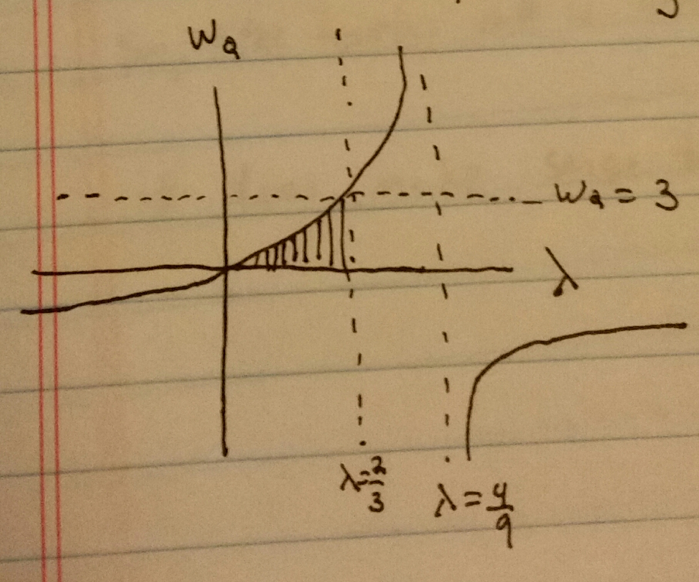

### Question 1 ###

At a driver's license facility, applicants arrive at a rate of approximately 10/hour. At check-in, a single clerk checks the applicant's driving history (if any) and gives the applicant the initial paperwork. Check-in takes approximately 5 minutes. The written exam is administered by one of two exam clerks. When an applicant arrives, s/he waits for an available clerk and, once one is available, takes the exam with the clerk. The exam requires approximately 8.8 minutes. At checkout, the applicant completes the process using one of two check-out computers and receives his/her temporary license. Check-out takes approximately 9 minutes.

a. How many "source", "server", "sink" do we need to develop this model, what do those objects stand for in the real system?


In order to develop this model, I used one source, one sink, and five servers. I also used one node, due to two stages of this system being in parallel. With this node, the entity's choice of checkout computer is independent of their choice of written exam station.

b. Develop your model in Simio. Show your screenshots including the parameters used in the model (e.g., interarrival time, capacity of the server, etc.)


The interarrival time was set at 6 minutes. No distribution was given for many of the interarrival and processing times, so I assumed them to be constant. If I wanted to include some randomness, I could have just added distributions to these formulas. Here I have 6 minutes as the interarrival time, which corresponds to 10/hour.


For the paths I removed the "drawn to scale" option. The path lengths weren't described in the problem, so I just set them to be 10 meters between stations.

Where there were bifurcations, I set my selection weight as "1", implying that there are equal chances entities will choose any path.


Here I set the processing time to 5 minutes.


I needed to set the node rule to "by link weight", in order to have the link weights of the paths determine the behavior of the entities.


Here you can once again see my path weighting as "1". This is the first bifurcation, and there's an equal chance of an entity choosing either path.


Here you can see the processing time, once again assumed to be constant according to the problem at 8.8 minutes.


Here I set the path length to be 5. I wanted the paths to join, and have the entities choose randomly between the two checkout computers. Basically, I wanted the choice of checkout computer to be independent of the choice of written exam station, and I wanted the path between these two stations to still be 10.


This is the node where the above mixing takes place.


Lastly, here's the logic of the checkout computer, showing the checkout time of 9 minutes.

c. Run the model and obtain the performance measures: Server Utilizations, Time in System, and Number in System. Determine the model run time and provide your supporting reason.


For server utlization, I'll use the "scheduledutilization" measure for each server. For the time in system and number in system, I'll use measurements from the entity section. These both have clear average measurements in the table.

d. The facility is considering to add an optional "computerized exam kiosk" to replace one of the two clerks. Applicants would have a choice between the exam administered by a human clerk and the computerized exam. The computer kiosk will support two exam-takers at a time. How would you modify the current Simio model? Show your related screenshots. (You do not have to run the model for this question)


I modified the model by adding a two parallel computer servers as one of the options, other than a single written exam center. I had to change a few of the path lengths, making the ones around the computer 2.5 meters for example to make sure the total lengths remain at 10. I kept these two computer kiosks at 8.8 minutes, although I could change them if necessary.

### Question 2 ###

Use both Simio and your own developed queueing simulation program to conduct a simulation study for a M/M/1 queue where the mean inter-arrival time equals to 10 minutes and the mean service time is about 7 minutes. Compare the following performance measures: system utilization rate ($\rho$), expected number of customers in the queue ($L_Q$), expected system time (W) obtained from the above simulators to the analytical solution and make your comments. 

My own queueing program:

First, I'm going to compute my arrival times in one shot, representing a simulation for 10000 minutes. For each arrival, I'll compute the entity's servicetime. Both of these will be pulled from exponential distributions using the rates given above (reciprocals of the means)

```{r}

library(dplyr)

arrivals <- 0

repeat{
  iat <- rexp(1,rate=1/10)
  
  if(tail(arrivals,1)+iat > 10000){
    break
  }else{
    arrivals <- c(arrivals,tail(arrivals,1)+iat)
  }
  
}

arrivals <- tail(arrivals,-1)

servicetimes <- rexp(length(arrivals),rate=1/7)

```

The departure times are not as straightforward. If there are 0 entities in the system, the departure time is simply the arrival time plus the service time. However, I needed to add some logic to account for the fact that entities could arrive while previous entities are still in service.

I calculate the departures sequentially. If the arrival of entity n is scheduled before departure of entity n-1, I can set the departure to include queuetime. By doing this for each entity starting from the beginning, my departure times will include all queue time.

I'll formalize an entity table by adding an entityID, and adding the corresponding arrivaltimes, servicetimes, and departuretimes.

```{r}

departures <- head(arrivals,1)+head(servicetimes,1)


for(i in 2:length(arrivals)){
  departures <- c(departures,
                          ifelse(departures[i-1]<arrivals[i],
                                 arrivals[i]+servicetimes[i],
                                 departures[i-1]+servicetimes[i]))
}

entityID <- 1:length(arrivals)

entityTable <- data.frame(entityID=entityID, arrival=arrivals, 
                          servicetime = servicetimes, departure=departures)

```

With this information, I can create an event table. This will list the arrival and departure events in chronological order, and will allow me to calculate the queue length and the number of entities in the system at the given times.

I do this in two parts. I create an eventTableA for arrivals and label the event types as arrivals, then create an eventTableB for departures and label the event types as departures. I combine these two tables into one (remembering to create a "start" event at 0), arrange it by eventTime to make sure they're chronological, and then begin my queue and number of entities in the system calculations.

For each arrival, I increase the number in the system by 1, and for each departure I decrease the number in the system by 1. Doing this sequentially allows me to get the number in the system at each event.

I create a queuelength variable by subtracting 1 from the number in system (unless the number of entities in the system is 0, in which case the queue remains at 0).

Lastly, I calculate an "intereventtime" variable, which will allow me to calculate a lot of the statistics of this simulation.

```{r}

eventTableA <- select(entityTable,-departure,-servicetime)
eventTableA$eventType <- "Arrival"

eventTableD <- select(entityTable,-arrival,-servicetime)
eventTableD$eventType <- "Departure"

colnames(eventTableA) <- c("entityID", "eventTime", "eventType")
colnames(eventTableD) <- c("entityID", "eventTime", "eventType")

eventTable <- rbind(data.frame(entityID=0,eventTime=0,eventType="Start"),
                    eventTableA,eventTableD) %>% arrange(eventTime)

numberInSystem <- 0

for(i in 2:length(eventTable$eventType)){
  numberInSystem[i] <- ifelse(eventTable$eventType[i] == "Arrival",
                              numberInSystem[i-1]+1, numberInSystem[i-1]-1)
}

eventTable$numberInSystem <- numberInSystem

eventTable$queueLength <- ifelse(eventTable$numberInSystem==0,0,
                                 eventTable$numberInSystem-1)

eventTable$interEventTime <- 
  c(tail(eventTable$eventTime,-1)-head(eventTable$eventTime,-1),0)

```

My server utilization rate will be the percentage of the time an entity is in the system. In other words, 1-(the probability of there being 0 entities in the system). 

$L_q$ is calculated by averaging the queue lengths, and weighting the average by the intereventtime. Similarly, I get L by doing this same average with the number of entities in the system.

Lastly, W, the expected time in the system, is calculated as the mean of the departure time minus the mean of the arrival times from the entity table.

```{r}

rho <- 1-(sum(filter(eventTable,numberInSystem==0)$interEventTime)/
  sum(eventTable$interEventTime))

Lq <- sum(eventTable$queueLength*eventTable$interEventTime)/
  sum(eventTable$interEventTime)

L <- sum(eventTable$numberInSystem*eventTable$interEventTime)/
  sum(eventTable$interEventTime)

W <- mean(entityTable$departure-entityTable$arrival)

rho
L
Lq
W

```

Here is the simio model I used to simulate this queue:


And here were my results, after running it for 10000 minutes:


In particular, $\rho$ is the ScheduledUtilization measure,  $L_q$ is average NumberInStation for the InputBuffer, and W is the TimeInSystem under modelentity (measured in hours, so it'll look like they don't match at first)

It looks like my results are pretty comparable! 

### DES Chapter 6 Question 1 ###

A tool crib has exponential interrival times and serves a very large group of mechanics. The mean time betweeen arrivals is 4 minutes. It takes 3 minutes on the average for a tool-crib attendant to service a mechanic. The attendant is paid $10 an hour and the mechanic is paid $15 an hour. Would it be advisable to have a second tool-crib attendant?

Lets consider these two cases.

$\lambda = \frac{1}{4}$,  $\mu = \frac{1}{3}$

Lets find out the long term average number of mechanics in the queue, and multiply this by their hourly rate to get the average amount we'd need to pay the mechanics.

1 attendant: 

$$ L = \frac{\lambda}{\mu - \lambda} = \frac{1/4}{1/12} = 3 $$

```{r}
3*15 + 10

```

So, 3 mechanics will be in the queue on average. At 15 an hour, this is an extra 45 an hour, leading to a total of 55 per hour with the 1 attendant.

2 attendants
With 2 attendants, this becomes an M/M/c queue:

$$ L = c \rho + \frac{(c \rho)^{c+1} P_0}{c(c!)(1- \rho )^2} $$

$$ P_0 = \left(  \left[ \sum_{n=0}^{c-1} \frac{(c \rho)^n}{n!} \right] + \left[ (c \rho)^c \left( \frac{1}{c!} \right) \frac{1}{1 - \rho} \right] \right)^{-1} $$

```{r}
c <- 2
lambda <- 1/4
mu <- 1/3
rho <- lambda/(c*mu)


P0 <- (sum(((c*rho)^(0:(c-1)))/factorial(0:(c-1))) + 
         (((c*rho)^c)*(1/factorial(c))*(1/1-rho)))^-1


L <- c*rho + (((c*rho)^(c+1))*P0)/(c*factorial(c)*((1-rho)^2))

15*L + 20

```


The lower costs due to having less mechanics in queue will make up for the hourly cost of the second attendant. It does make sense to hire a second attendant.

### DES Chapter 6 Question 2 ###

A two-runway (one runway for landing, one runway for taking off) airport is being designed for propeller-driven aircraft. The time to land an airplane is known to be exponentially distributed, with a mean of 1.5 minutes. If airplane arrivals are assumed to occur at random, what arrival rate can be tolerated if the average wait in the sky is not to exceed 3 minutes?

According to page 247, arrivals for infinite population models can assume to be Poisson processes, meaning that their interarrival times are exponentially distributed.

This would make this an M/M/1 queue.

Given a known $\mu$, service rate, of 1/average service time, or $\frac{1}{1.5} = \frac{2}{3}$, we would like to find out what kind of arrival rate $\lambda$ we can tolerate if the average wait in the sky is not to exceed 3 minutes. The inequality we have is:

$$ W_Q \leq \frac{\lambda}{\mu (\mu - \lambda)} $$

$$ 3 \leq \frac{\lambda}{2/3(2/3 - \lambda)} $$

It's helpful to look at this inequality graphically:



We're concerned with the shaded region. The assymptote represents the queue becoming long-term unstable, meaning that the queue length will increase w/o bound beyond that point. The solution to the inequality is that any rate lower than $\lambda = \frac{2}{3}$


