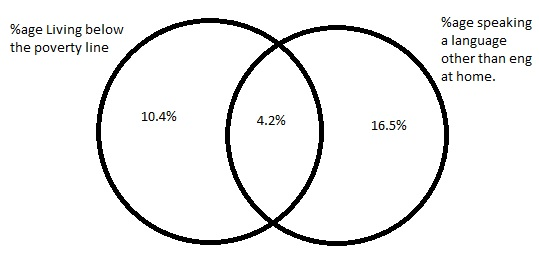

### 2.6 Dice Rolls ###

If you roll a pair of fair dice, what is the probability of

a. Getting a sum of 1? 0, the smallest sum you can get is 2.

b. Getting a sum of 5? $\frac{4}{36}$. The 4 cases are (1,4), (2,3), (3,2), and (4,1)

c. Getting a sum of 12? $\frac{1}{36}$. The only way to do this is to roll two 6's.

### 2.8 Poverty and Language ###

The American Community Survey is an ongoing survey that provides data every year to give 
communities the current information they need to plan investments and services. The 2010 
American Community Survey estimates that 14.6% of Americans live below the poverty line, 
20.7% speak a language other than English at home, and 4.2% fall into both categories.

a. Are living below the poverty line and speaking a foreign language at home disjoint?
No, because it's possible for both of these events to occur.

b. Draw a ven diagram summarizing the variables and their associated probabilities.




c. What percent of Americans live below the poverty line and only speak English at home?
10.4%. 14.6% - the 4.2% of Americans who fall in both categories.

d. What percent of Americans live below the poverty line or speak a foreign language at home?
31.1%. Add up all the numbers in the venn diagram. Alternatively, add 20.7% and 14.6%, and 
subtract 4.2% (since you would count this group twice otherwise.)

e. What percent of Americans live above the poverty line and speak only English at home?
68.9%. Subtract 31.1%, the percentage of Amerians that live below the poverty line or speak a 
foreign language at home, since everyone not fitting both of these characteristics wouldn't be 
present in the Venn diagram.

f. Is the event that someone lives below the poverty line independent of the event that the person 
speaks a foreign language at home? If these were independent, then the probability of both these 
events occurring would just be P(living below poverty line)*P(speaking a language other than english
at home). These two probabilities multiplied together are 3.02%. The fact that the joint probability 
is actually 4.2% implies there's some correlation between these two qualities.

### 2.20 Assortive Mating ###

Assortative mating is a nonrandom mating pattern where individuals with similar genotypes and/or 
phenotypes mate with one another more frequently than what would be expected under a random mating 
pattern. Researchers studying this topic collected data on eye colors from 204 Scandinavian men 
and their female partners.

a. What is the probability that a randomly chosen male respondent OR his partner have blue eyes?
This means that out of 204 couples, one is chosen, and ONE of the partners has blue eyes. This can 
occur in any of the cases in the "blue" row OR column. So, $\frac{78+23+13+19+11}{204}$, or 
$\frac{144}{204}$.

b. What is the probability that a randomly chosen male respondent with blue eyes has a partner 
with blue eyes? THe only situation where this will occur is if both partners have blue eyes, which 
is $\frac{78}{204}$

c. What is the probability that a randomly chosen male respondent with brown eyes has a partner with
blue eyes? $\frac{19}{204}$ What about the probability of a randomly chosen male respondent with 
green eyes having a partner with blue eyes? $\frac{11}{204}$

d. Does it appear that the eye color of male respondents and their partners are independent? explain
your reasoning. Using males with blue eyes and females with brown eyes as an example, I'll use the 
same test I used above of seeing if P(males with blue eyes)*P(females with blue eyes) = P(couples 
with blue eyes). So:

```{r}

(23/55)*(23/114)

(23/204)

```

I would expect these to be closer if they truly were independent. It would appear they are not.

### 2.30 Books on a Bookshelf ###

The table below shows the distribution of books on a bookcase based on whether they are nonfiction 
or fiction and hardcover or paperback.

a. Find the probability of drawing a hardcover book first then a paperback fiction book second 
when drawing without replacement.

$$\frac{28}{95} \times \frac{59}{94}$$

```{r}

(28/95)*(59/94)

```

b. Determine the probability of drawing a fiction book first and then a hardcover book second, when 
drawing without replacement. 

Since we're dealing without replacemen, I have to deal with the fact that the first fiction book 
I pick can be hardcover or paperback. So, I'll add the probabilities of picking a fiction 
hardcover book first and the probability of picking a fiction paperback second.

$$\frac{13}{95} \times \frac{27}{94} + \frac{59}{95} \times \frac{28}{94}$$


```{r}

(13/95)*(27/94) + (59/95)*(28/94)

```

c. Calculate the probability of the scenario in part (b), except this time complete the calculations
under the scenario where the first book is placed back on the bookcase before randomly drawing the 
second book.

In this case, we don't have to worry about adding the probabilities.

$$\frac{72}{95} \times \frac{28}{95}$$

```{r}

(72/95)*(28/95)


```

d. The final answers to parts (b) and (c) are very similar. Explain why this is the case.

This is the case because whether or not replacement happens changes the sample size, and therefore 
the denominator only changes slightly. There would have been more of a change with a smaller sample 
size.

### 2.38 Baggage Fees ###

An airline charges the following baggage fees: $25 for the first bag and $35 for the second. 
Suppose 54% of passengers have no checked luggage, 34% have one piece of checked luggage, and 
12% have two pieces. We suppose a negligible portion check more than two bags. 

a. Build a probability model, compute the average revenue per passenger, and compute the 
corresponding standard deviation.

The average revenue per passenger is the expected value.

```{r}

ex <- 0.54*0 + 0.34*25 + 0.12*35

```

The standard deviation is 

```{r}

sqrt(0.54*(0-ex)^2 + 0.34*(25-ex)^2 + 0.12*(35-ex)^2)

```

b. About how much revenue should the airline expect for a flight of 120 passengers? With what
standard deviation? Note any assumptions you make and if you think they are justified. 

The expected value should stay the same no matter what the size of the population. That will always 
be $12.7. The standard deviation, however, will shrink as the population grows. Even if the expected 
value is the same (and the proportion of each discrete value is the same), the standard deviation 
will change.

### 2.44 Income and Gender ###

The relative frequency table below displays the distribution of annual total personal income for a
representative sample of 96,420,486 Americans. These data come from the American Community Survey 
for 2005 to 2009. The sample is comprised of 59% males and 41% females.

a. Describe the distribution of total personal income.

b. What is the probability that a randomly chosen resident makes more than $50,000 a year?

```{r}

.139+.058+.084+.097

```

c. What is the probability that a randomly chosen US resident makes less than $50,000 per year and 
is female? Note any assumptions you make

If we're assuming that that women and men have the same income distribution, we can calculated this 
by just multiplying the probabilities:

```{r}

0.41*(0.022+0.047+0.158+0.183+0.212)

```
