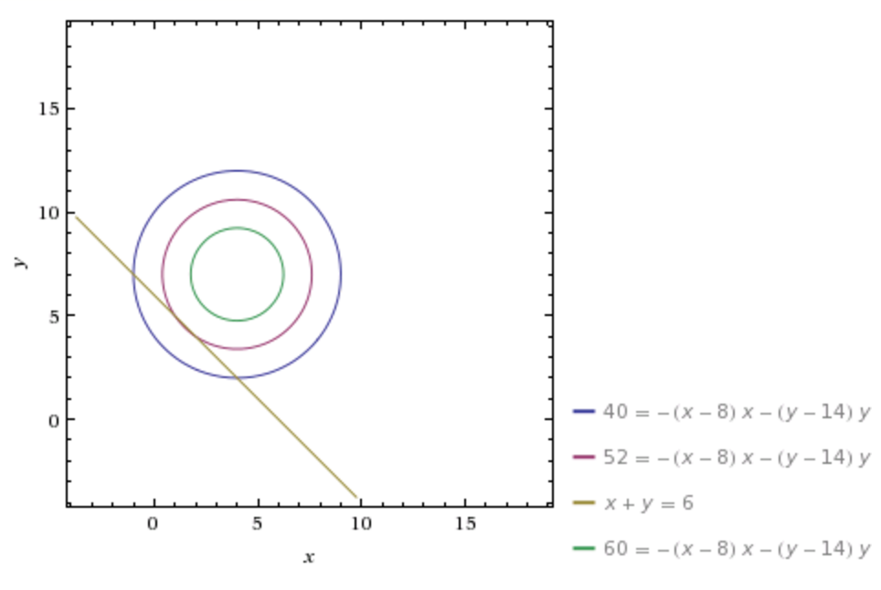

The pan population model can also be seen in terms of linear programming.



```{r}

p0 <- c(4,2)

u1 <- function(p){
  return(-p[1]+8)
}

u2 <- function(p){
  return(-p[2]+14)
}

c12 <- function(f){
  return(2*f[1])
}

c21 <- function(f){
  return(2*f[2])
}


flowcalc <- function(p){
  if(u2(p) > u1(p)){
    f1 <- (p[1] - p[2] + 6)/4
    f <- c(f1,0)
  }else if(u1(p) > u2(p)){
    f2 <- (p[2] - p[1] - 6)/4
    f <- c(0,f2)
  }else{f <- c(0,0)}
  
  return(f)
}

pdata <- data.frame(p1 = 4, p2 = 2, u1 = u1(p0), u2 = u2(p0), 
                    totu = sum(p0*c(u1(p0),u2(p0))))


for(i in 1:10){
  p <- c(tail(pdata$p1,1),tail(pdata$p2,1))
  f <- flowcalc(p)
  u <- c(u1(p),u2(p))
  totu <- sum(p*u)

  pdata <- rbind(pdata, c(p[1]-f[1]+f[2], p[2]+f[1]-f[2], u, totu))
}


```

