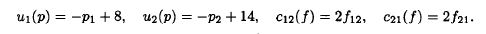
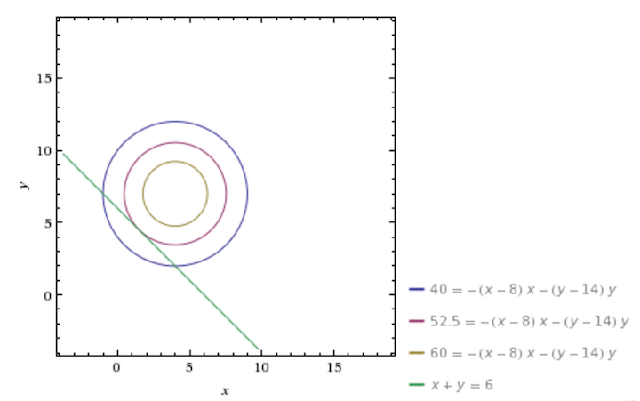

## R Markdown

This is an R Markdown presentation. Markdown is a simple formatting syntax for authoring HTML, PDF, and MS Word documents. For more details on using R Markdown see <http://rmarkdown.rstudio.com>.

When you click the **Knit** button a document will be generated that includes both content as well as the output of any embedded R code chunks within the document.

## Slide with Bullets

- Bullet 1
- Bullet 2
- Bullet 3

## Slide with R Code and Output

```{r}
summary(cars)
```

## Slide with Plot

```{r, echo=FALSE}
plot(cars)
```

## Markov Chain Model of Migration


## Two Region Markov Chain Example

- Outlined in the paper "Using Markov Chains to Model Human Migration in a Network Equilibrium Framework", by J. Pan and A. Nagurney

- For the individual, each region is assumed to have its own utility function, which is a function of its population, and a cost of moving, which is a function of the number of people moving in the current iteration. 

- The two regions have an initial population vector $p = [p_1, p_2]$

- The flow matrix, which we solve for, will be $F = \left[ \begin{array}{cc} f_{11} & f_{12} \\ f_{21} & f_{22} \end{array} \right]$

## Two Region Markov Chain Example

- This leaves us with the functions $u_1 (p)$, $u_2 (p)$, $c_{12} (f)$ and $c_{21} (f)$. 

- People will move from locations of lower utility to locations of higher utility.

- At each iteration, we can solve the following for f:

$$ u_i (p) + c_{ij} (f) = u_j (p) $$

## Two Region Markov Chain Example




```{r include=FALSE}

library(ggplot2)

library(reshape2)

library(knitr)

library(ggthemes)

u1pan <- function(p){
  return(-p[1]+8)
}

u2pan <- function(p){
  return(-p[2]+14)
}

c12pan <- function(f){
  return(2*f[1])
}

c21pan <- function(f){
  return(2*f[2])
}

```

## Two Region Markov Chain Example

```{r}

flowcalcpan <- function(p){
  if(u2pan(p) > u1pan(p)){
    f1 <- (p[1] - p[2] + 6)/4
    f <- c(f1,0)
  }else if(u1pan(p) > u2pan(p)){
    f2 <- (p[2] - p[1] - 6)/4
    f <- c(0,f2)
  }else{f <- c(0,0)}
  
  return(f)
}

```

## Two Region Markov Chain Example

```{r}

p0 <- c(4,2)

u0 <- c(u1pan(p0), u2pan(p0))

pdatapan <- data.frame(p1 = 4, p2 = 2, u1 = u0[1], u2 = u0[2], totu = p0 %*% u0 )

iter <- 1:5

for(i in iter){
  p <- c(tail(pdatapan$p1,1),tail(pdatapan$p2,1))
  f <- flowcalcpan(p)
  p[1] <- p[1]-f[1]+f[2]
  p[2] <- p[2]+f[1]-f[2]
  u <- c(u1pan(p),u2pan(p))
  totu <- p %*% u

  pdatapan <- rbind(pdatapan, c(p[1], p[2], u, totu))
}


```

## Social Utility

```{r echo=FALSE}
kable(pdatapan, format = "markdown")

```

## Social Utility

- In the last slide, you can see an extra column added: total utility.
- This is equal to the individual utility at each location times the population of each location
- or, $p \times u^T$, with p as the population vector and u as the utility vector, whose lengths are the number of locations.
- In this model, it is not guarenteed that people acting in their own self interest will lead to a socially optimal distribution.

## Maximizing Social Utility

- This is solveable by linear programming

- $u_{TOT} = p \times u$

- $u_{TOT} = p_1 (8-p_1) + p_2 (14-p_2)$

- Subject to: $p_1 + p_2 = p_{TOT} = 6$

## Maximizing Social Utility



## Maximizing Social Utility

- Social Utility is Maximized at $p_1 = 1.5$, and $p_2 = 4.5$


## Achieving Maximum Social Utility

- How can a society achieve maximum social utility?

- Lets model the decision that taxes the residents in the higher utility region and redistributes the gains to the lower utility region

## Achieving Maximum Social Utility


