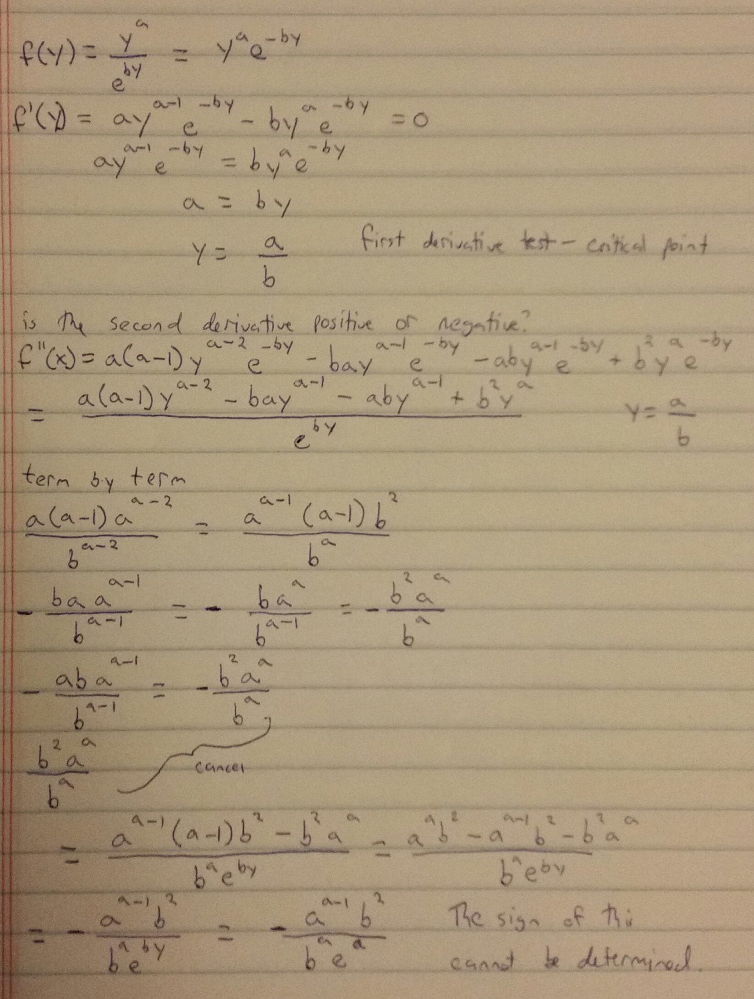

### Page 529, Question 1 ###

Verify that the given function pair is a solution to the first-order system

$$ x = -e^t , y = e^t $$
$$ \frac{dx}{dt} = -y , \frac{dy}{dt} = -x $$

$$ \frac{dx}{dt} = -e^t, y = e^t, \frac{dx}{dt} = -y $$
$$ \frac{dy}{dt} = e^t, x = -e^t, \frac{dy}{dt} = -x $$

### Page 529, Question 6 ###

Find and classify the rest points of the given autonomous system:

$$ \frac{dx}{dt} = -(y-1) , \frac{dy}{dt} = x-2 $$

Stationary point when $\frac{dx}{dt}$ and $\frac{dy}{dt}$ are 0, happens at (2,1)

This point is stable. Any points close to (2,1) will orbit the point at a constant radius. Given any point, radius r from the point (2,1), the coordinates of the point will be ($rcos(\theta), rsin(\theta)$), with $\theta$ being the angle between the segment drawn from the point to (2,1), and the horizontal line y=1. The magnitude of the change at any point along the circle drawn around (2,1) with this radius will be r.

### Page 546, Question 1 ###

Apply the first and second derivative tests to the function $f(y) = \frac{y^a}{e^{by}}$. Show that $y = \frac{a}{b}$ is a unique critical point that yields the relative maximum f(a/b). Show also that f(y) approaches 0 as y tends to infinity.

The first derivative of this clearly shows a local extrema at a/b, but the second derivative is unclear unless a and b are defined. As an example, the case where a=1 and b=1 indeed has a maxima when y = 1, but if a=2, negative values of y tend towards infinity.

f(y) does however approach 0 as y tends to infinity. The numerator has a constant exponent, a, while the denominator has an exponent that tends to infinity (by). This means the fraction will tend towards 0 overall.

