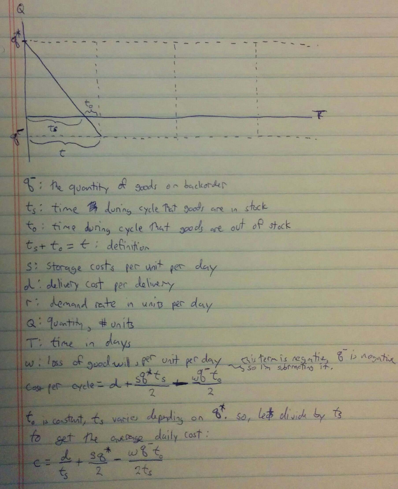
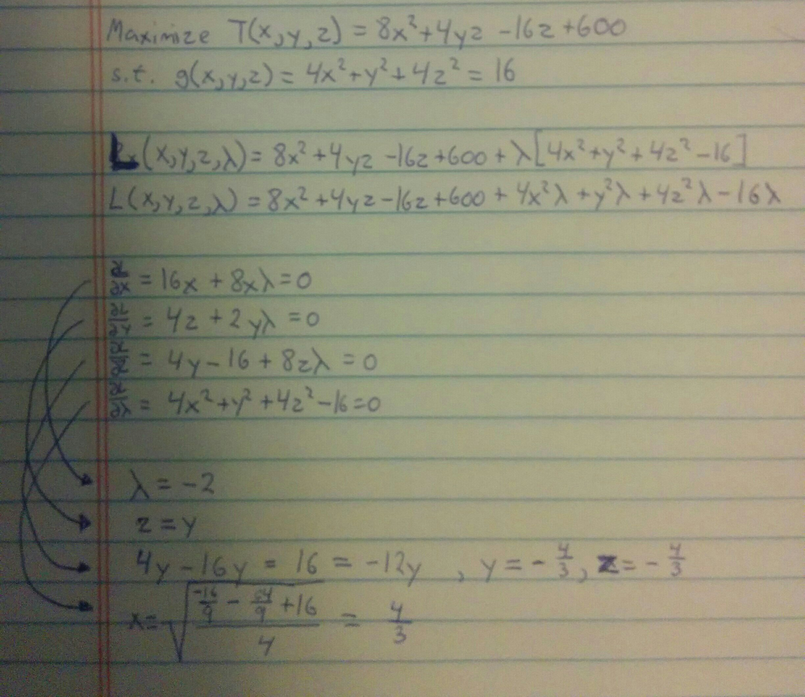

### Page 576 Question 2 ###

Consider a company that allows back ordering. That is, the company notifies customers that a temporary stock-out exists and that their order will be filled shortly. What considtions might argue for such a policy? What effect does such a policy have on storage costs? Should costs be assigned to stock-outs? Why? How would you make such an assignment? What assumptions are implied by the model in Figure 13.7? Suppose a "loss of goodwill cost" of w dollars per unit per day is assigned to each stock-out. Compute the optimal order quantity Q* and interpret your model.

Such a policy might be useful to cut down on storage costs, and minimize customers that don't have their desired products in stock. In the first case, allowing for stock-out would allow a company to not keep certain less popular items in stock. They wouldn't have to pay long term storage for products that weren't popular (or if the product was truly not popular, decide to not carry it due to storage costs.) In the second case, the company could be more liberal with its stock policy. If there is a stock-out allowance, it's not critical for a company to make sure stock doesn't drop to 0. If it does, they could simply put it on back order.

Overall, this should be expected to lower storage costs, since the company could be more liberal with its popular items, and might not have to carry less popular items unless needed.

There are a few costs that could be associated with stock-outs. The suggested cost of w dollars per unit per day for "loss of goodwill cost" could be seen as the lost cost by customers for future purchases. There could also be a fixed cost, necessary to maintain a department of back ordering that takes in customer orders and orders from suppliers. Perhaps there could be delivery costs as well, ordering bulk on a fixed schedule is probably cheaper than delivering on call products.

The model in figure 13.7 is assuming that inventories are allowed to run to 0. Once additional orders come in (bringing the quantity to negative), a new order is made. This model implies that order amounts are fixed (Q returns to the same high value). The slopes of the lines appear equal, so this is assuming a pretty steady rate of demand. This steady rate of demand actually leads me to believe that maintaining a stock-out policy might not be best for this good. It wouldn't be too hard to just predict when the quantity is going to reach 0, and order in advance of that.

If there is a "loss of goodwill cost", this is what my model would look like.



$\frac{wq^{-} t_o}{2}$ can be thought of as a constant, so we're going to minimize this function for $q^{*}$, with $q^{*}$ being related to $t_s$


### Page 584 Question 2 ###

Find the local minimum value of the function:

$$ f(x,y) = 3x^2 + 6xy + 7y^2 - 2x + 4y $$

First, lets calculate the derivative:

$$ \frac{\partial f}{\partial x} = 6x + 10y + 7y^2 - 2 $$
$$ \frac{\partial f}{\partial y} = 3x^2 + 4x + 14y + 4 $$

```{r}

dfx <- function(x,y){
  return(6*x + 6*y - 2)
}

dfy <- function(x,y){
  return(6*x + 14*y + 4)
}

nextstep <- function(data){
  x <- tail(data$x,1)
  y <- tail(data$y,1)
  lambda <- tail(data$lambda,1)
  delta <- tail(data$delta,1)
  newx <- x - lambda*dfx(x,y)
  newy <- y - lambda*dfy(x,y)
  newlambda <- lambda*delta
  return(c(newx,newy,newlambda,delta))
}

data <- data.frame(x=0, y=0, lambda = 0.05, delta = 1.001)

for(i in 1:1000){
  data <- rbind(data,nextstep(data))
}

plot(data$x)

plot(data$y)

tail(data)

```

### Page 588 Question 5 ###


