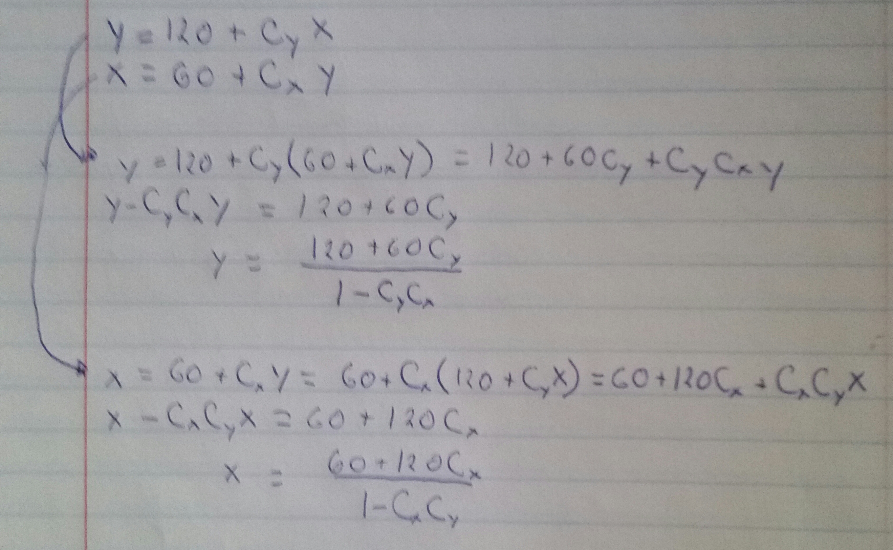
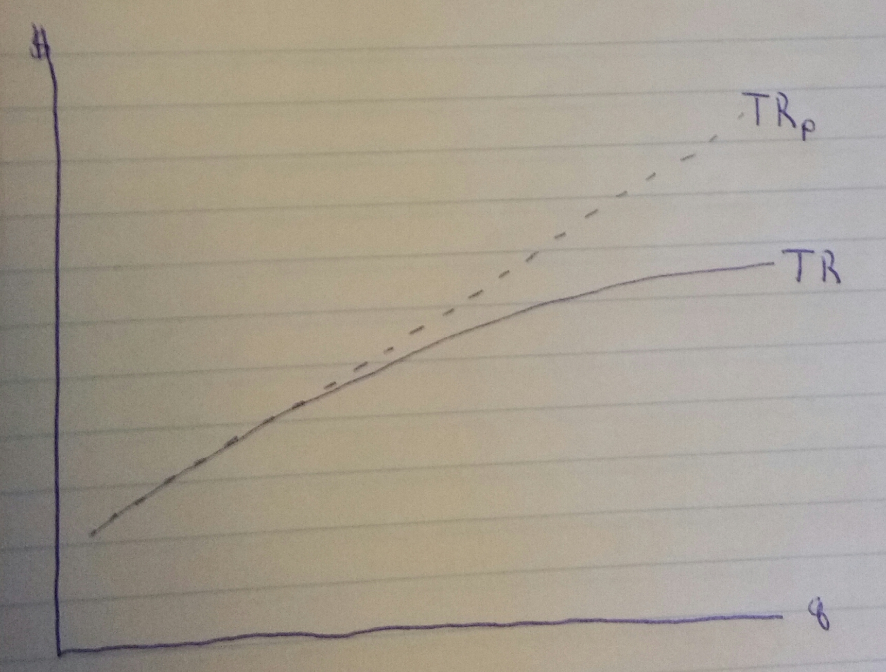
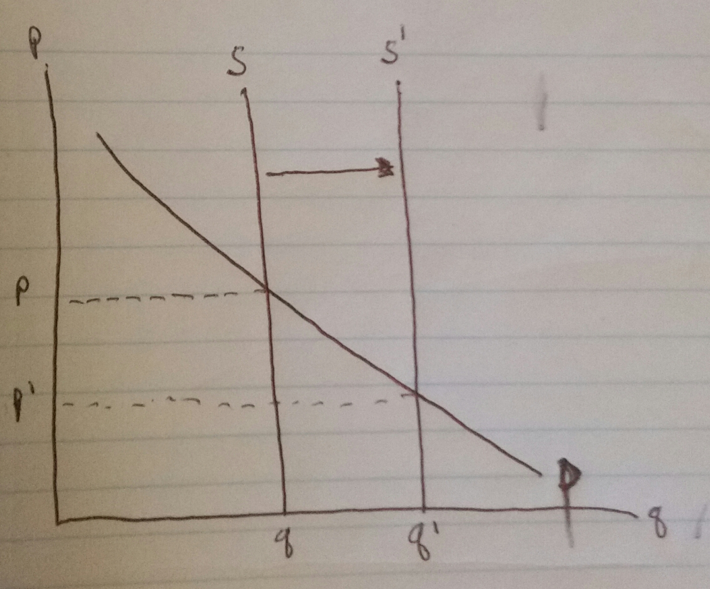

### Page B-13 Question 4 ###

Discuss how you might go about validating the nuclear arms race model. What data would you collect? Is it possible to obtain the data?

THe sort of data we'd need to collect to validate this data would be missile count data and records of technological change. Different cases, similar to those described earlier in the chapter, could be looked for in world history. Using the US and Soviet Union as an example, we could try to quantify the changes in parameters that certain technological advances would lead to, and see if they had the expected affects on missile stockpiles in the two countries. Or, civil defense expenditures could be looked at.

One example not shown in the chapter would be something like Star Wars. This was a technological project designed to increase the efficiency of their missiles. If the US is country X and USSR country y, Star wars would change x=g(y), in the opposite way as it does in Example 2. The graph would shift outwards, signifying that country y's missiles are easier to shoot down, and therefore more are needed.

### Page B-17 Question 1 ###

Build a numerical solution to Equations (15.8).

a. Graph your results

```{r}

library(ggplot2)
library(reshape2)

x0 <- 100
y0 <- 200
xs <- 1/3
ys <- 0.5
limit=25

graphstart <- function(x0,y0,xs=(1/3),ys=0.5,limit=25){

  n <- 0
  
  data <- data.frame(x=x0,y=y0,n=n)
  
  repeat{
    
    y <- 120 + ys*tail(data$x,1)
    x <- 60 + xs*tail(data$y,1)
    n <- tail(data$n,1) + 1
    
    data <- rbind(data,c(x,y,n))
    
    if(n == limit) break
    
  }
  
  xequil <- signif(tail(data$x,1))
  yequil <- signif(tail(data$y,1))
  
  data <- melt(data,id.vars="n",variable.name="country",value.name="arms")
  
  ggplot(data,aes(x=n,y=arms,color=country)) + geom_line() +
    ggtitle(paste("X0 = ",x0," and Y0 = ",y0,"\n",
                  "x survival param = ",signif(xs,1),"       ",
                  "y survival param = ",signif(ys,1),"\n",
                  "x equilibrium = ",xequil,"       ",
                  "y equilibrium = ",yequil,sep=""))
  
}

graphstart(100,200)


```

b. Is an equilibrium value reached? Yes it is, at x=120 and y=180

c. Try other starting values. Do you think the equilibrium value is stable?

Lets try the above function for a few different values:

```{r}
graphstart(500,500)

graphstart(-500,500)

graphstart(500,-500)

graphstart(-500,-500)

graphstart(150,150)

```

Based on my tests above, it looks like the equilibrium values are stable.

d. Explore other values for the survival coefficients of countries X and Y. Describe your results.

We've shown that different start values are stable, so I'll experiment with different parameters

```{r}

graphstart(150,150,0.5,0.5)
graphstart(150,150,0.9,0.5)
graphstart(150,150,0.9,0.9)
graphstart(150,150,0.9,-0.9)
graphstart(150,150,-0.9,-0.9)

#just to see where this converges
graphstart(150,150,-0.9,-0.9,1000)

```

Lets try to formalize this. Equilibrium point is the point at which $y_{n+1} = y_n$ and $x_{n+1} = x_n$. This is only dependent on the x and y survival parameters (and this was shown graphically). Below I solved the two equations for the equilibrium described above, to get the equilibriums x and y in terms of the two survival constants.



```{r}

dtable <- expand.grid(seq(0.1,0.9,by=0.1),seq(0.1,0.9,by=0.1))

colnames(dtable) <- c("xparam","yparam")

valuereturn <- function(xp,yp){
  x <- (120+60*xp)/(1-xp*yp)
  y <- (60+120*yp)/(1-xp*yp)
  return(list(x=x,y=y))
}

dtable$xequil <- valuereturn(dtable$xparam,dtable$yparam)$x

dtable$yequil <- valuereturn(dtable$xparam,dtable$yparam)$y

dtable
```


### Page B-21 Question 4 ###

Verify the result that the marginal revenue of the q+1st unit equals the price of that unit minus the loss in revenue on previous units resulting from price reduction.

Consider the situation in the book, where we're studying a firm that is too small to have an effect on prices. The TR curve is a straight line, the slope is constant and equal to the price. The equation of the TR curve is $TR = p \times q$.

Now lets assume that prices follow the laws of supply and demand. As quantity produced increases, prices decrease. The relationship $TR = p \times q$ still stands, but p changes. Here's an example of $TR_p$, where the price doesn't change, vs $TR$, where the price decreases with increasing units sold.



This decision can be represented by the supply/demand graph in the attached:



With a vertical supply curve, the demand curve is what decides the price. As quantity supplied increases, price will decrease. In this way, we can come up with a function of price in terms of quantity. p = f(q), which we can plug into our TR formula:

$$ TR = f(q) \times q $$

The marginal revenue is the derivative of the TR curve:

$$ MR = f'(q) \times q + f(q) $$

And lets look at this equation in the context of our verification. We'd like to verify that the marginal revenue of the q+1st unit minus the loss in total revenue on the previous units. f'(q) is negative, and represents the change in price multiplied by the quantity, while f(q) is the price of the next unit.
