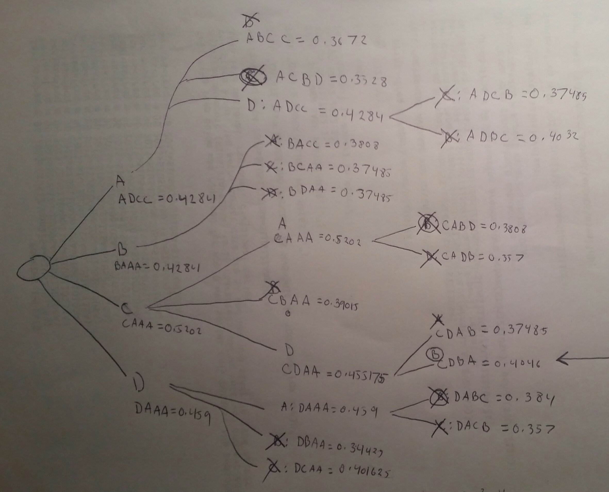

I wrote the below function to help out with this algorithm:

```{r}

probs <- matrix(c(0.9,0.7,0.85,0.75,
                  0.8,0.6,0.7,0.7,
                  0.9,0.8,0.85,0.75,
                  0.85,0.7,0.8,0.7),nrow=4)

rownames(probs) <- c("A","B","C","D")

highestprob <- function(vec){
  
  highprob <- 1
  for(i in 1:length(vec)){
    highprob <- highprob*as.numeric(probs[vec[i],i])
  }
  if(length(vec)<4){
    maxindexlist <- vec
    rowlist <- rownames(probs)[!(rownames(probs) %in% vec)]
    for(i in (length(vec)+1):4){
      maxindex <- names(which(probs[rowlist,i] == max(probs[rowlist,i])))[1]
      highprob <- highprob*as.numeric(probs[maxindex,i])
      maxindexlist <- c(maxindexlist,maxindex)
    }
  }else{
    maxindexlist <- vec
  }
  return(list(assignments = maxindexlist, prob = highprob))
}


```

And ended up drawing out the results by hand:



It looks like the team cannot be arranged in a way such that the probability of success exceeds 45%, so the manager won't approve the project.
