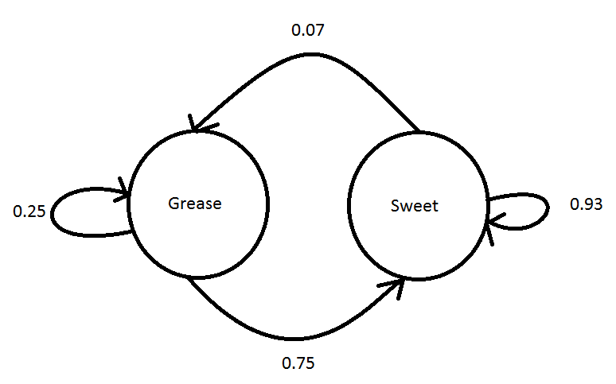

### Page 228, Question 1 ###

Consider a model for the long-term dining behavior of the students at College USA. It is found that 
25% of the students who eat at the college's Grease Dining Hall return to eat there again, whereas 
those who eat at Sweet Dining Hall have a 93% return rate. These are the only two dining halls on 
campus, and assume that all students eat at one of these halls. Formulate a model to solve for the 
long-term percentage of students eating at each hall.


Next State are columns, Current State are rows.
             
          
|       | Grease | Sweet |
|------:|-------:|------:|
|Grease | 0.25   | 0.75  |
|Sweet  | 0.07   | 0.93  |



$$ g_{t+1} = 0.25g_t + 0.07s_t $$
$$ s_{t+1} = 0.75g_t + 0.93s_t $$


```{r}

iterations <- 15

dining <- data.frame(n=0, grease=1, sweet=0)

for(i in 1:iterations){
  dining <- rbind(dining, c(i, tail(dining$grease,1)*0.25 + tail(dining$sweet,1)*0.07,
                    tail(dining$grease,1)*0.75 + tail(dining$sweet,1)*0.93))
}

library(reshape2)
library(ggplot2)

ggplot(melt(dining, id="n"), aes(x=n, y=value, color=variable)) + geom_line()

```

The steady state is reached after about 10 steps, at:

```{r}

tail(dining,8)

```


### Page 232, Question 1 ###

Consider a stereo with a CD player, FM-AM radio tuner, speakers (dual), and power amplifier 
(PA) components, as displayed with the reliabilities shown in Figure 6.11. Determine the 
system's reliability. What assumptions are required in your model?

I'm dividing the model into three sub systems: The PA, The CD and FM-AM radio, and the two 
speakers. The latter two sub systems are parallel, while the PA is a single unit.

```{r}

rtotalt <- 0.95*(0.98+0.97-0.98*0.97)*(0.99+0.99-0.99*0.99)

rtotalt

```

### Page 240, Question 1 ###

Use a basic linear model $y = ax + b$ to fit the following data sets. Provide the model, 
provide the values of SSE, SSR, SST, and $R^2$

```{r}

mhw <- data.frame(height=60:80, weight = c(132, 136, 141, 145, 150, 155, 160, 165, 170, 
                                           175, 180, 185, 190, 195, 201, 206, 212, 218, 
                                           223, 229, 234))

m <- length(mhw$height)

```

I can solve this by using both the formulas in the book for a and b, and using R's built in 
lm function.

```{r}

a <- (m*sum(mhw$height*mhw$weight) - sum(mhw$height)*sum(mhw$weight))/
  (m*sum(mhw$height^2) - sum(mhw$height)^2)

b <- (sum(mhw$height^2)*sum(mhw$weight) - sum(mhw$height*mhw$weight)*sum(mhw$height))/
  (m*sum(mhw$height^2) - sum(mhw$height)^2)

mhwmodel <- lm(weight~height, data=mhw)

alm <- mhwmodel$coefficients[[2]]
blm <- mhwmodel$coefficients[[1]]

sse <- sum((mhw$weight-(a*mhw$height + b))^2)
sst <- sum((mhw$weight - mean(mhw$weight))^2)
ssr <- sst - sse
r2 <- 1-(sse/sst)

```

My model is $weight = a \times height + b$, with a and b defined below. 
Along with SSE, SST, SSR, and $R^2$:

```{r}

a

b

sse

sst

ssr

r2

mhw$residuals <- summary(mhwmodel)$residuals

ggplot(mhw, aes(x=height, y=residuals)) + geom_point()

```

There appears to be a pattern in te residuals, so perhaps the regression will work better with 
height cubed.

### Page 240, Question 2 ###

For table 2.7, predict weight as a function of the cube of the height

```{r}

mhw$heightcubed <- mhw$height^3

a <- (m*sum(mhw$heightcubed*mhw$weight) - sum(mhw$heightcubed)*sum(mhw$weight))/
  (m*sum(mhw$heightcubed^2) - sum(mhw$heightcubed)^2)

b <- (sum(mhw$heightcubed^2)*sum(mhw$weight) - sum(mhw$heightcubed*mhw$weight)*sum(mhw$heightcubed))/
  (m*sum(mhw$heightcubed^2) - sum(mhw$heightcubed)^2)

mhwmodel <- lm(weight~heightcubed, data=mhw)

alm <- mhwmodel$coefficients[[2]]
blm <- mhwmodel$coefficients[[1]]

sse <- sum((mhw$weight-(a*mhw$heightcubed + b))^2)
sst <- sum((mhw$weight - mean(mhw$weight))^2)
ssr <- sst - sse
r2 <- 1-(sse/sst)

```

My model is $weight = a \times height^3 + b$, with a and b defined below. 
Along with SSE, SST, SSR, and $R^2$:

```{r}

a

b

sse

sst

ssr

r2

mhw$residuals <- summary(mhwmodel)$residuals

ggplot(mhw, aes(x=height, y=residuals)) + geom_point()

```

I wouldn't trust that either... the residuals have a lower absolute value, but they are in a 
curvilinear pattern. However, going back to a scatter plot of the data, the pattern is highly 
linear:

```{r}

ggplot(mhw, aes(x=height, y=weight)) + geom_point()

```

I'm actually not positive what one would want to do in a situation like this: where the pattern is 
overwhelmingly linear, but there is a slight pattern in the residuals. Eyeballing the numbers, it 
seems like there is a very slight pattern in how the numbers deviate from a linear model.

In this case, higher order models don't seem to do anything to the residuals (and if anything 
seem to have higher values.) I could however imagine a case where they provided a slight improvement.
The decision would have to be made about whether or not to use the simpler model that captures the 
vast majority of the variation, or to go with a higher order model that is a bit more correct. I 
don't think this is the same as the bias/variance tradeoff... it seems like a slightly different 
issue.
