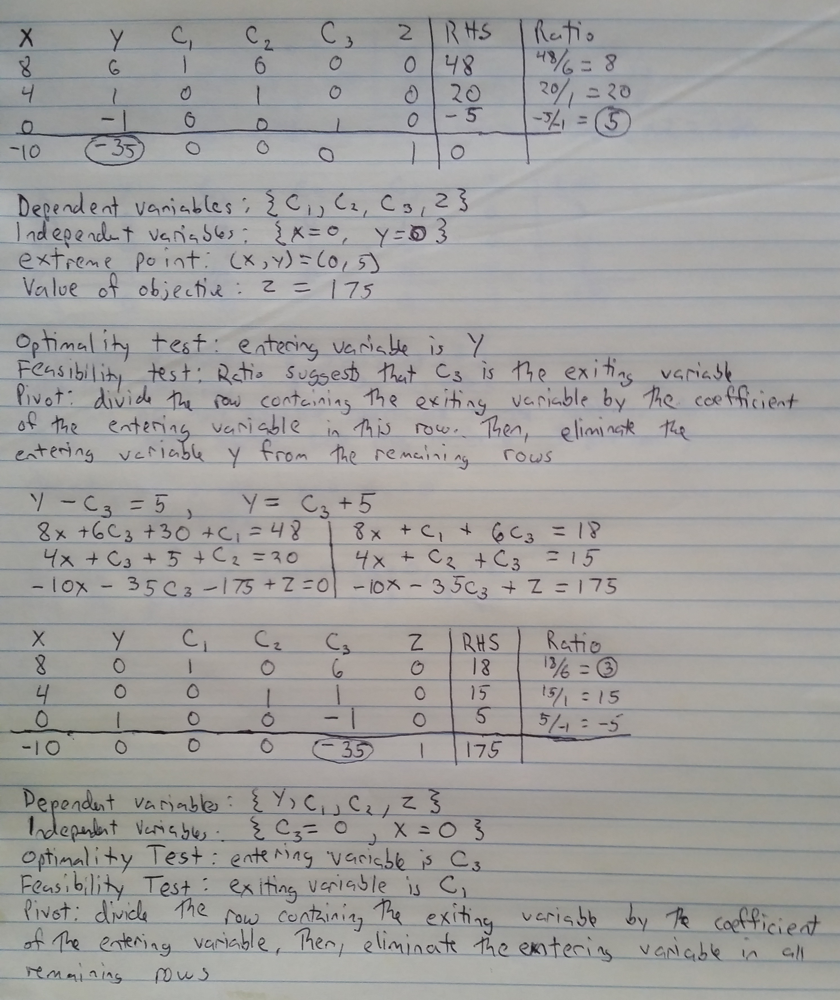
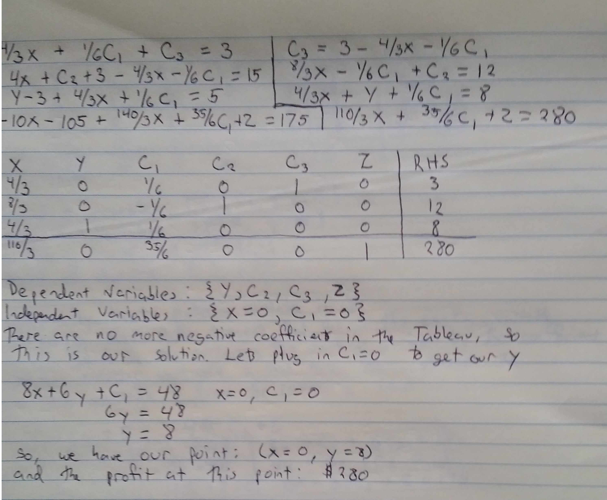

### Page 251, Question 2. Nutritional Requirements ###

A rancher has determined that the minimum weekly nutritional requirements for an average sized 
horse include 40lb of protein, 20lb of carbohydrates, and 45lb of roughage. These are obtained 
from the following sources in varying amounts at the prices indicated:

|                                    | Protein (lb) | Carbs (lb) | Roughage (lb) | Cost  |
|-----------------------------------:|-------------:|-----------:|--------------:|------:|
| Hay (per bale)                     | 0.5          | 2.0        | 5.0           | $1.80 |
| Oats (per sack)                    | 1.0          | 4.0        | 2.0           | $3.50 |
| Feeding Blocks (per block)         | 2.0          | 0.5        | 1.0           | $0.40 |
| High Protein Conc. (per sack)      | 6.0          | 1.0        | 2.5           | $1.00 |
| Requirements per horse (per week)  | 40.0         | 20.0       | 45.0          |       |

----------------------------------------------------

*Relationships:*

Protein = (0.5 $\times$ Hay) + (1 $\times$ Oats) + (2 $\times$ FB) + (6 $\times$ HPC)

Carbs = (92 $\times$ Hay) + (4 $\times$ Oats) + (0.5 $\times$ FB) + (1 $\times$ HPC)

Roughage = (5 $\times$ Hay) + (2 $\times$ Oats) + (1 $\times$ FB) + (2.5 $\times$ HPC)

Cost = (1.8 $\times$ Hay) + (3.5 $\times$ Oats) + (0.4 $\times$ FB) + (1 $\times$ HPC)

----------------------------------------------------

*Constraints:*

Protein > 40

Carbs > 20

Roughage > 45

----------------------------------------------------

*Optimization:*

Minimize Cost

### Page 264, Question 6 ###

Minimize 10x + 35y subject to:

(Board feet of lumber, hours of carpentry, demand, nonnegativity)

$$ 8x + 6y \leq 48 $$
$$ 4x + y \leq 20 $$
$$ y \geq 5 $$ 
$$ x, y \geq 0 $$

I'll solve all of these for y and graph them out in ggplot, to get an idea of my feasible zone:

```{r}
x <- seq(0,5,by=0.1)

data <- data.frame(x = x, boardfeet = (48-8*x)/6, hours = 20-4*x, demand = 5)

library(reshape2)

data <- melt(data, id.vars="x", value.name="y")

library(ggplot2)

ggplot(data, aes(x=x, y=y, color=variable)) + geom_line()

```

My feasible zone is below the red line (board-feet of lumber), below the green line (hours of 
carpentry), above the blue line (demand), and above 0. So, the feasible zone is the triangle defined 
by y=5, x=0, and the boardfeet line 8x + 6y = 48. This means that the slope of the objective function 
will determine which point, (0,8) or (2.25,5) the optimization occurs. If the slope is more negative 
than the boardfeet line ($-\frac{4}{3}$), then the optimized point will occur at (2.25, 5). 
Otherwise, it will occur at (0,8).

The slope of the line 10x + 35y = c is $-\frac{10}{35}$, or $-\frac{2}{7}$. This is not more negative 
than the boardfeet slope, so the optimum will occur at (0,8). Lets graph this out.

If the line 10x + 35y = c crosses through (0,8), then 35*8 = c, so c = 280. Lets add this to our 
lines:

```{r}

x <- seq(0,5,by=0.1)

data <- data.frame(x = x, boardfeet = (48-8*x)/6, hours = 20-4*x, demand = 5, 
                   objective = (280-10*x)/35, objectivetest = (350-10*x)/35)

data <- melt(data, id.vars="x", value.name="y")

ggplot(data, aes(x=x, y=y, color=variable)) + geom_line()

```

Here I graphed the objective along with a test, with c a bit higher (at 350). You can see if it's a
bit higher, it's outside of the feasible zone.

### Page 268, Question 6 (Algebraic Solution) ###

This time we're going to rewrite the equations in question 6

Maximize 10x + 35y subject to:

$$ 8x + 6y + c1 = 48 $$
$$ 4x + y + c2 = 20 $$
$$ y + c3 = 5 $$

Here we won't consider the case of setting y = 0, because we already know $y \geq 5$. So, we'll 
be solving this by setting four variables to 0 two at a time: x, c1, c2, and c3.

Lets look at the graph again:

```{r}
x <- seq(0,5,by=0.1)

data <- data.frame(x = x, boardfeet = (48-8*x)/6, hours = 20-4*x, demand = 5)

data <- melt(data, id.vars="x", value.name="y")

ggplot(data, aes(x=x, y=y, color=variable)) + geom_line()

```

c1, c2 = 0

$$ 8x + 6y = 48 $$
$$ 4x + y = 20 $$
$$ y - c3 = 5 $$

This correspondes to the point (4.5, 2), with c3 = -3, x = 4.5, and y = 2. This is not feasible 
because c3 is negative. This corresponds to the intersection of the red and green lines.

c1, c3 = 0

$$ 8x + 6y = 48 $$
$$ 4x + y + c2 = 20 $$
$$ y = 5 $$

This corresponds to the point (2.25, 5), with c2 = 6, x=2.25, and y = 5. This is a feasible point, 
and on the graph it corresponds to the intersection of the blue and red lines.

c2, c3 = 0

$$ 8x + 6y + c1 = 48 $$
$$ 4x + y = 20 $$
$$ y = 5 $$

This corresponds with the values c1 = -12, x = 3.75, and y = 5. We know this isn't a feasible point 
because c1 is negative, and the three slack variables we picked need to be nonnegative. This point 
is (3.75, 5), and corresponds to the intersection of the green and blue lines.

c1, x = 0

$$ 6y = 48 $$
$$ y + c2 = 20 $$
$$ y - c3= 5 $$

This corresponds with the values c2 = 12, c3 = 3, and y = 8. This is feasible, and corresponds 
with the point (0,8), which is feasible. This is at the y-intercept of the red line.

c2, x = 0

$$ 6y + c1 = 48 $$
$$ y = 20 $$
$$ y - c3 = 5 $$

This corresponds with the values c1 = -71, c3 = 15, and y = 20. This is not feasible since c1 is 
negative, and corresponds to the point (0,20). This is the y-intercept of the green line.

c3, x = 0

$$ 6y + c1 = 48 $$
$$ y + c2 = 20 $$
$$ y = 5 $$ 

This corresponds with the values c1 = 18, c2 = 15, and y = 5. This corresponds to the point (0,5), 
and is feasible. This corresponds with the y-intercept of the blue line.

Solving algebraically, we have three feasible points: (0,5), (0,8), and (2.25, 5). Lets plug 
these back into the objective function:

x    | y    | 10x + 35y
-----|------|-----------
 0   | 5    | 175
 0   | 8    | 280
2.25 | 5    | 197.5

This gives us the same answer we had before, the point that maximizes this function is at (0,8).


### Page 278, Question 6 (Simplex Solution) ###

See the write-ups below:





### Page 284, Question 1 ###

For the example problem in this section, determine the sensitivity of the optimal solution to a 
change in $c_2$ using the objective function $25x_1 + c_2 x_2$

In the example program we can build on the fact that we know that the extreme point (12,15) remains 
optimal as long as the slope of the objective function is less than $-\frac{2}{3}$ but greater than 
$\frac{5}{4}$. With $c_2$ variable, the slope is $-\frac{25}{c_2}$. So, we end up with the 
inequality:

$$ -\frac{5}{4} \leq -\frac{25}{c_2} \leq -\frac{2}{3} $$

Or

$$ 20 \leq c_2 \leq \frac{75}{2} $$

$c_2$ is the profit per bookcase. If this profit drops below 20, the carpenter should produce only 
tables. If the profit becomes greater than $32.50 per bookcase, the carpenter should produce only 
bookcases. If the profit remains between these two values, than the carpenter should stick to the 
current optimal value of 12 tables and 15 bookcases.

### Page 295, Question 3 ###

Use the Curve Fitting Criterion to minimize the sum of the absolute deviations for the following 
models and data set:

a. $y = ax$

b. $y = ax^2$

c. $y = ax^3$

First lets define our data:

```{r}

x <- c(7,14,21,28,35,42)
y <- c(8,41,133,250,280,297)

data <- data.frame(x=x, y=y, x2=x^2, x3=x^3)


```

for each part of this question, I can define a cost function. The cost function is simply:

$$ f(c) = \sum |y-ax^k| $$

Where k is the power we're raising it to, 1 in a, 2 in b, and 3 in c.

There are a few problems with this method. We need to define the interval beforehand, which means we 
need to have an idea of where the desired a lies. Lets just solve using the lm function to find 
some approximations of where we should be looking (we won't expect them to match, since with lm we're 
minimizing the sum of the squared errors, but it should give us a ballpark goal.

```{r}

summary(lm(y~x+0,data=data))

summary(lm(y~x2+0,data=data))

summary(lm(y~x3+0,data=data))

```

All of these are between [0,10], so I'll use that as my interval. I'm also setting a tolerance level 
as 0.01.

At the end of the while loop, the data frame solvetable will give me the values a and b, which give 
a range of possible values for a that is within my set tolerance.

a. $y = ax$

```{r}

psi <- ((1+sqrt(5))/2)-1

cost <- function(a, data){
  sum(abs(data$y - a*(data$x)))
}


a <- 0
b <- 10
c1 <- a+(1-psi)*(b-a)
c2 <- a+psi*(b-a)
fc1 <- cost(c1,data)
fc2 <- cost(c2,data)

solvetable <- data.frame(a=a,b=b,c1=c1,c2=c2,fc1=fc1,fc2=fc2)

tolerance <- 0.01

t <- 1

while(t > tolerance){
  if(fc1<=fc2){
    b <- c2
    c1 <- a+(1-psi)*(b-a)
    c2 <- a+psi*(b-a)
    fc1 <- cost(c1,data)
    fc2 <- cost(c2,data)
    solvetable <- rbind(solvetable,c(a,b,c1,c2,fc1,fc2))
    t <- b-a
  } else{
    a <- c1
    c1 <- a+(1-psi)*(b-a)
    c2 <- a+psi*(b-a)
    fc1 <- cost(c1,data)
    fc2 <- cost(c2,data)
    solvetable <- rbind(solvetable,c(a,b,c1,c2,fc1,fc2))
    t <- b-a
  }
}

solvetable

```

Now lets just redefine our cost function and do the same thing for b and c:

b. $y = ax^2$

```{r}
psi <- ((1+sqrt(5))/2)-1

cost <- function(a, data){
  sum(abs(data$y - a*(data$x^2)))
}


a <- 0
b <- 10
c1 <- a+(1-psi)*(b-a)
c2 <- a+psi*(b-a)
fc1 <- cost(c1,data)
fc2 <- cost(c2,data)

solvetable <- data.frame(a=a,b=b,c1=c1,c2=c2,fc1=fc1,fc2=fc2)

tolerance <- 0.01

t <- 1

while(t > tolerance){
  if(fc1<=fc2){
    b <- c2
    c1 <- a+(1-psi)*(b-a)
    c2 <- a+psi*(b-a)
    fc1 <- cost(c1,data)
    fc2 <- cost(c2,data)
    solvetable <- rbind(solvetable,c(a,b,c1,c2,fc1,fc2))
    t <- b-a
  } else{
    a <- c1
    c1 <- a+(1-psi)*(b-a)
    c2 <- a+psi*(b-a)
    fc1 <- cost(c1,data)
    fc2 <- cost(c2,data)
    solvetable <- rbind(solvetable,c(a,b,c1,c2,fc1,fc2))
    t <- b-a
  }
}

solvetable

```

c. $y = ax^3$

```{r}
psi <- ((1+sqrt(5))/2)-1

cost <- function(a, data){
  sum(abs(data$y - a*(data$x^3)))
}


a <- 0
b <- 10
c1 <- a+(1-psi)*(b-a)
c2 <- a+psi*(b-a)
fc1 <- cost(c1,data)
fc2 <- cost(c2,data)

solvetable <- data.frame(a=a,b=b,c1=c1,c2=c2,fc1=fc1,fc2=fc2)

tolerance <- 0.01

t <- 1

while(t > tolerance){
  if(fc1<=fc2){
    b <- c2
    c1 <- a+(1-psi)*(b-a)
    c2 <- a+psi*(b-a)
    fc1 <- cost(c1,data)
    fc2 <- cost(c2,data)
    solvetable <- rbind(solvetable,c(a,b,c1,c2,fc1,fc2))
    t <- b-a
  } else{
    a <- c1
    c1 <- a+(1-psi)*(b-a)
    c2 <- a+psi*(b-a)
    fc1 <- cost(c1,data)
    fc2 <- cost(c2,data)
    solvetable <- rbind(solvetable,c(a,b,c1,c2,fc1,fc2))
    t <- b-a
  }
}

solvetable

```
