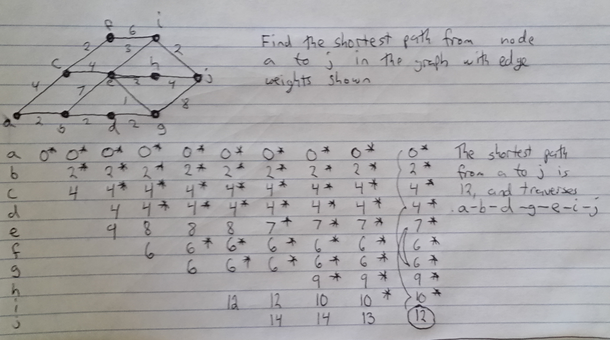

### Page 304, Question 2 ###

The bridges and land masses of a certain city can be modeled with graph G in figure 
8.7. 

a. Is G Eulerian? Why or why not? 

G is not Eulerian because the entire graph is not even. Vertices 2 and 5 have odd 
numbers of edges.

b. Suppose we relax the requirement of the walk so that the walker need not start 
and end at the same land mass but still must traverse every bridge exactly once. 
Is this type of walk possible in a city modeled by the graph in figure 8.7? If 
so, how? If not, why not?

Relaxing this assumption, this walk is possible in the modeled city. There are 
two odd vertices, and if you start at one, and end in the other, you will be able 
to cross each bridge exactly once. If there are more than two odd vertices, such 
a walk would not be possible. If there were one odd vertex, the only requirement 
would be that you must start OR end at that vertex.

### Page 307, Question 1 ###

Consider the graph in Figure 8.11

a. Write down the set of edges E(G)

E(G) = {ab, af, ae, bd, bc, cd, de, df, ef}

b. Which edges are incident with vertex b? 

Edges ab, bd, and bc.

c. Which vertices are adjacent to vertex c? 

Vertices b and d are adjacent to vertex c.

d. Compute deg(a)

deg(a) = 3

e. compute |E(G)|

|E(G)| = 9

### Page 320, Question 10 ###

A basketball coach needs to find a starting lineup for her team. There are five 
positions that must be filled: point guard (1), shooting guard (2), swing (3), 
power forward (4), and center (5). Given the data in Table 8.7, create a graph 
model and use it to find a feasible starting lineup. What changes if the coach 
decides she can't play Hermione in position 3?

A feasible solution to this problem would be, A1, C2, H3, G4, and D5. The 
algorithm I used was just to pick the highest player on the list who could play 
a given position and wasn't taken already. If I ran into an impossible situation, 
I'd re-assign a player to the postion that needed to be played and chose another 
player for the newly vacant position. Doing this, I started out with A1, then C2 
(because A2 wasn't available). Then D3 and G4. D only had the ability to play 5, 
so I assigned her there, and was forced to reassign position 3 to H.

If the coach decides she can't play Hermione in position 3, I'll have to choose 
someone else for that position. So, the only other available person is G. G is 
currently playing position 4, so I need to reassign position 4 to the only other 
player with the skill needed, D. D is the only player that can play position 5, 
so that position must remain vacant. If Hermione can't play position 3, there is 
no assignment of positions that works.

### Page 331, Problem 1 ###

### Page 331, Problem 3 ###

Use our maximum-flow algorithm to find the maximum flow from s to t in the 
graph of figure 8.31.

1: $s - x_1 - y_1 - t$, flow = 1
2: $s - x_2 - y_3 - t$, flow = 2
3: $s - x_3 - y_1 - t$, subtract $s - x_1 - y_1 - t$, flow = 2
4: $s - x_1 - y_2 - t$, flow = 3
5: $s - x_4 - y_3 - t$, subtract $s - x_2 - y_3 - t$, flow = 3
6: $s - x_2 - y_6 - t$, flow = 4

### Page 338, Problem 4 ###

Write down the linear program associated wiht solving maximum flow from s to t 
in the graph below

Maximize: 

$$ x_{sa} + x_{sb} $$

Subject to the capacity constraints:

$$ x_{sa} \leq 4 $$
$$ x_{sb} \leq 5 $$
$$ x_{ab} \leq 3 $$
$$ x_{ac} \leq 2 $$
$$ x_{bc} \leq 1 $$
$$ x_{bd} \leq 6 $$
$$ x_{dc} \leq 2 $$
$$ x_{ct} \leq 7 $$
$$ x_{dt} \leq 3 $$

And subject to the flow balance constraints:

$$ x_{sa} = x_{ab} + x_{ac} $$
$$ x_{sb} + x_{ab} = x_{bc} + x_{bd} $$
$$ x_{ac} + x_{bc} + x_{dc} = x_{ct} $$
$$ x_{bd} = x_{dc} + x_{dt} $$
