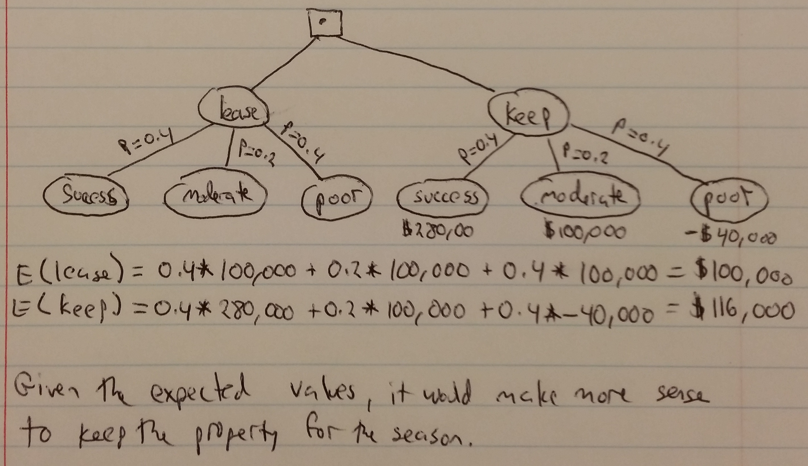
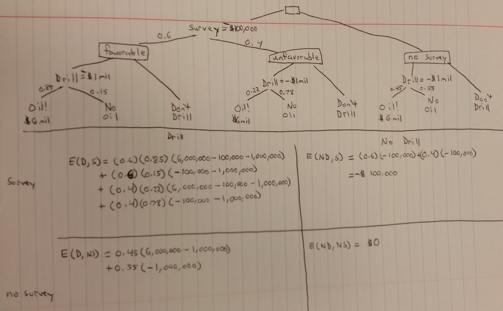

### Page 347, Question 4 ###

We gave engaged in a business venture. Assume the probability of success is 
$P(s) = \frac{2}{5}$; further assume that if we are successful we make 55,000, 
and if we are unsuccessful we lose 1750. Find the expected value of the business 
venture.

$$ E(bv) = P(s) \times 55000 + (1-P(s)) \times -1750 $$
$$ E(bv) = \frac{2}{5} \times 55000 + \frac{3}{5} \times -1750 = 20,950 $$

### Page 347, Question 6 ###

Consider a firm handling concessions for a sporting event. The firm's manager 
needs to know whether to stock up with coffee or cola and is formulating 
policies for specific weather predictions. A local agreement restricts the firm 
from selling only one type of beverage. The firm estimates a 1500 profit selling 
cola if the weather is cold and a 5000 profit of selling cola if the weather is 
warm. The firm also estimates a 4000 profit selling coffee if it is cold and a 
1000 profit selling coffee if the weather is warm. The weather forecast says 
that there is a 30% chance of a cold front; otherwise, the weather will be 
warm. Build a decision tree to assist with the decision. What should the firm 
handling concessions do?


### Page 355, Question 3 ###

The financial success of a ski resort in Squaw Valley is dependent on the amount 
of early snowfall in the fall and winter months. If the snowfall is greater 
than 40 inches, the resort always has a successful ski season. If the snow is 
between 30 and 40 inches, the resort has a moderate season, and if the snowfall 
is less than 30 inches, the season is poor, and the resort will lose money. The 
seasonal snow probabilities from the weather service are displayed in the 
following table with the expected revenue for the previous 10 seasons. A hotel 
chain has offered to lease the resort during the winter for 100,000. You must 
decide whether to operate yourself or lease the resort. Build a decision tree 
to assist in the decision.



### Page 364, Question 3 ###

A big private oil company must decide whether to drill in the Gulf of Mexico. It 
costs 1 million to drill, and if oil is found its value is estimated at 6 million.
At present, the oil company believes there is a 45% chance that oil is present. 
Before drilling begins, the big private oil company can hire a geologist for 
100,000 to obtain samples and test for oil. There is only about a 60% chance 
that the geologist will issue a favorable report. Given that the geologist 
does issue a favorable report, there is an 85% chance that there is oil. Given 
an unfavorable report, there is a 22% chance that there is oil. Determine what 
the big private oil company should do.



```{r}

o <- 6000000
d <- -1000000
s <- -100000

EDS <- (0.6)*(0.85)*(o+d+s) + (0.6)*(0.15)*(d+s) + 
  (0.4)*(0.22)*(o+d+s) + (0.4)*(0.78)*(d+s)

EDNS <- (0.45)*(o+d) + (0.55)*(d)

EDS

EDNS


```

The big private oil company should hire the researcher, and whether or not they 
hire the researcher, they should drill. If they hire the researcher and drill, 
their expected value is 2,488,000. If they don't hire the researcher and drill, 
their expected value is 1,700,000.

### Page 373, Question 1 ###

Given the following payoff matrix:

a. Which alternative do we choose if our criterion is to maximize the expected 
value?

```{r}

EA <- 0.35*1100 + 0.3*900 + 0.25*400 + 0.1*300
EB <- 0.35*850 + 0.3*1500 + 0.25*1000 + 0.1*500
EC <- 0.35*700 + 0.3*1200 + 0.25*500 + 0.1*900

EA
EB
EC

```

Based on maximizing the expected value, we should choose alternative B.

b. Find the opportunity loss (regret) table and compute the expected opportunity 
loss (regret) for each alternative. What decision do you make if your criterion 
is to minimize expected regret?

```{r}

EA <- 0.35*(0)+0.3*(1500-900)+0.25*(1000-400)+0.1*(900-300)
EB <- 0.35*(1100-850)+0.3*(0)+0.25*(0)+0.1*(900-500)
EC <- 0.35*(1100-700)+0.3*(1500-1200)+0.25*(1000-500)+0.1*(0)

EA
EB
EC

```


Option B minimizes the expected regret, with a value of 127.5.
