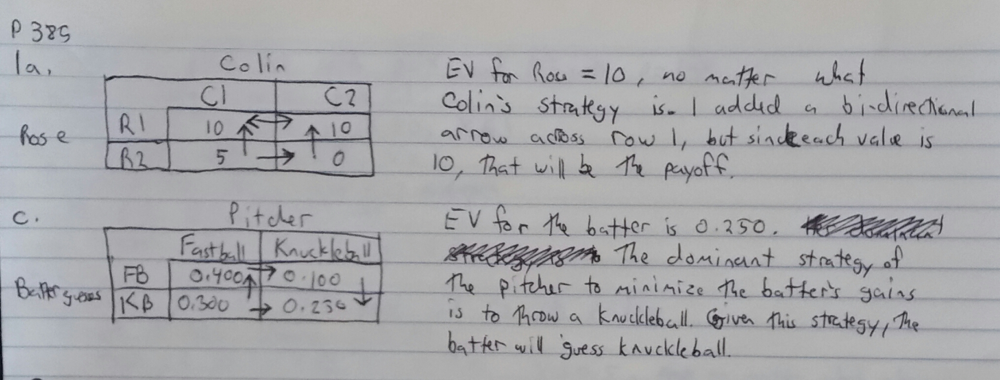
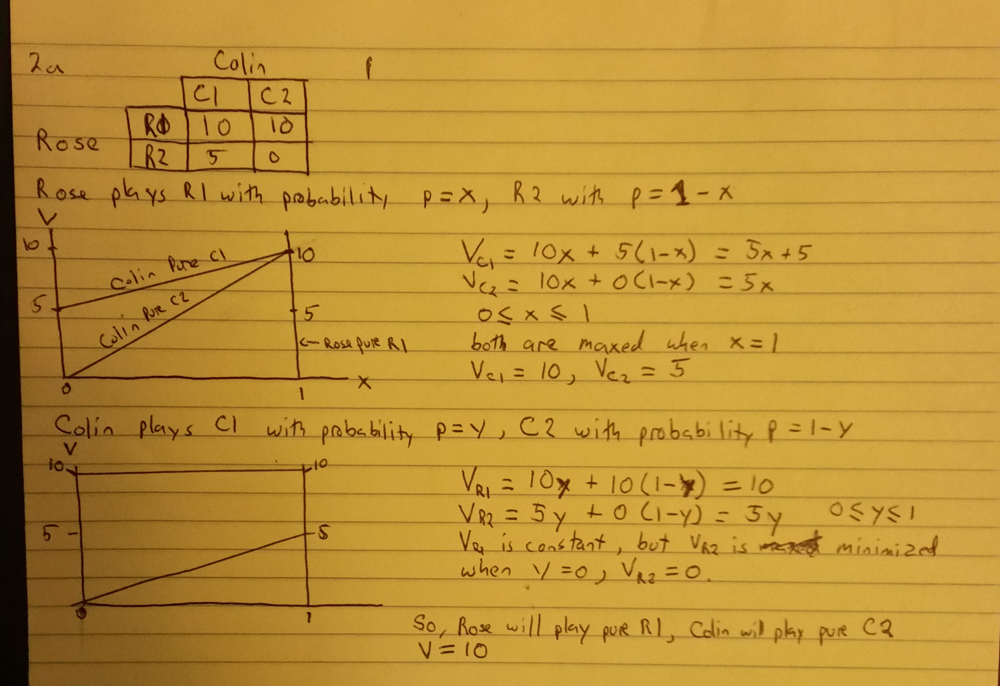
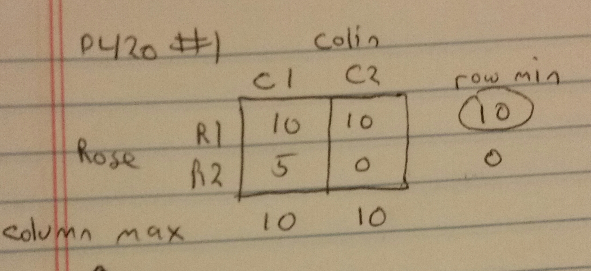
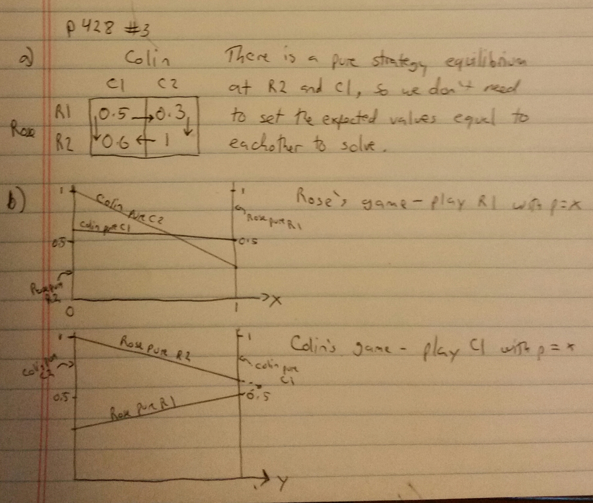
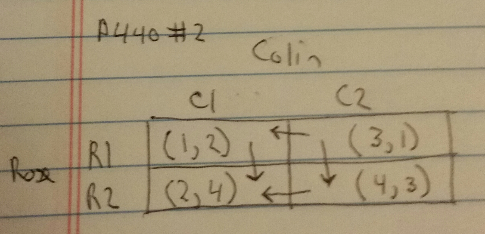

### Page 385, 1a and 1c ###

Using the definition provided for the movement diagram, determine whether the following zero-zum games have a pure strategy Nash equilibrium. If the game does have one, state the Nash Equilibrium. Assume the row player is maximizing his payoffs which are shown in the matrices below.

1a. EV for Rosa = 10, no matter what Colin's strategy is. I added a bidirectional arrow across row 1, but since each value is 10, that will be the payoff.

1c. EV for the batter = 0.25. The dominant strategy of the pitcher to minimize the batter's gains is to throw a knuckleball. Given this strategy, the batter will guess a knuckleball.

### Page 404, 2a ###

Build a linear programming model for each player's decisions and solve it both geometrically and algebraically. Assume the row player is maximizing their payoffs which are shown in the matrices below.

### Page 420, 1 ###

We solved this earlier using arrows, which showed that Colin will pay C2 and Rosa will play R1. Lets see what happens when we try maximin-minimax:

Looks like this solution leaves Colin's strategy open. the payoffs are both 10, and there is no minimax. Either way Rose will end up with 10.

### Page 428, 3 ###

This has a pure strategy solution, so none of the solutions in this section will work. In part b, you'll see the intersection point of Colin's strategies happening outside of the constraints.

### Page 440, 2 ###

This game has a Nash equilibrium at R2 and C1, with Colin getting 4 and Rose getting 2.

Rose would rather Colin choose C2. If Colin chose C2, Rose would end up with 4, but Colin would only end up with 3. Without any changes in incentives, no promises or threats would induce Colin to choose C2.

The combined payoff in C2,R2, however, is higher. If Rose agreed too give Colin part of her payoff, she could perhaps strike a bargain. If these are dollar amounts being received, for example, and this is a repeating game, Rose could agree to give Colin alternating amounts of $1 or $2 if he chooses C2. The repeat nature of the game allows both players to "split" that extra value when Colin plays C2. Over time, Colin's expected payoff could be greater than 4, inducing him to choose C2 and let Rose have an expected payoff greater than 2.

